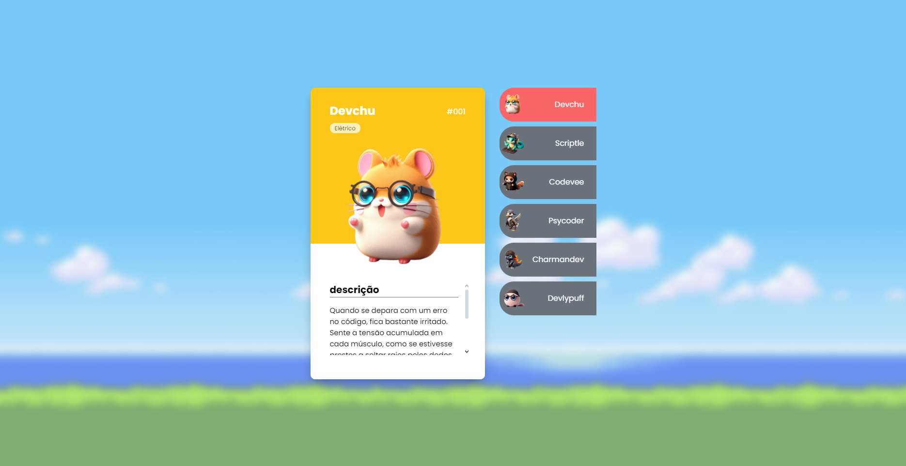
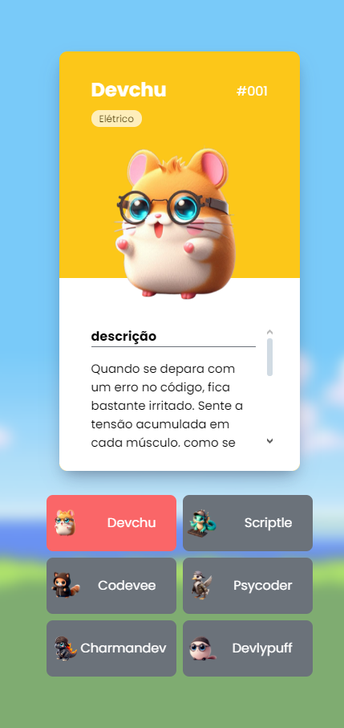

## Descrição

Projeto Pokedevs do Dev em Dobro, um projeto criado usando os conceitos básicos de HTML5 CSS3 e Javascript.

O projeto foi feito com o intuito de demonstrar as habilidades adquiridas na semana para a construção de uma página web.

  

Também feito de forma que possa ser responsivo em diferentes tipos de tamanho de telas.

  

  
  

Link para o Site do Projeto -> <a href="https://felipeonmarques.github.io/pokedevs/" target="_blank"> Projeto Pokedevs </a>
